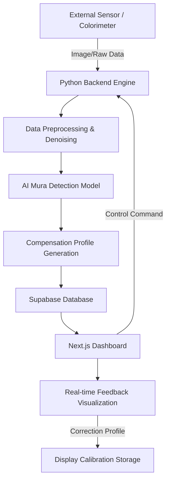

# 차세대 디스플레이 광학 교정 리포트: AI 기반 AR/VR 마이크로 디스플레이 통합 보정 시스템

## 1. Research Motivation & Challenges
차세대 공간 컴퓨팅 디바이스의 핵심 부품인 Micro-OLED 및 Micro-LED 디스플레이는 초고해상도 밀도를 달성하는 과정에서 서브픽셀 단위의 휘도 불균일성(Luminance Non-uniformity)과 미세한 색 편차(Color Deviation) 문제를 수반한다. 특히 AR/VR 환경에서는 디스플레이의 광학적 특성이 배율 렌즈를 통해 사용자에게 직접 투사되므로, 미세한 결함도 몰입감을 저해하는 무아레(Mura) 현상으로 전개된다.

렌즈 시스템을 통한 기하학적 왜곡(Geometric Distortion)과 색수차(Chromatic Aberration)는 단순히 화질을 저하시키는 것을 넘어, 양안 시차의 불일치를 유발하여 장시간 사용 시 사용자에게 심각한 시각적 피로도(Visual Fatigue)와 어지럼증을 유발한다. 본 연구는 이러한 물리적 한계를 정밀한 광학 계측 데이터와 AI 기반 보정 알고리즘을 통해 극복하고, 디스플레이의 균일성을 극대화하는 것을 목적으로 한다.

## 2. Optical Foundation & Colorimetry
정밀한 색채 교정을 위해 본 시스템은 CIE 1931 표준 관찰자 모델에 기반한 수치적 보정을 수행한다.

### 2.1 Color Space Transformation
입력된 sRGB 또는 Adobe RGB 신호를 디바이스 독립적 공간인 CIE XYZ로 변환하기 위해 다음과 같은 선형 변환 행렬을 적용한다:

$$
\begin{bmatrix}
X \\
Y \\
Z
\end{bmatrix}
=
\begin{bmatrix}
0.4124 & 0.3576 & 0.1805 \\
0.2126 & 0.7152 & 0.0722 \\
0.0193 & 0.1192 & 0.9505
\end{bmatrix}
\begin{bmatrix}
R_{linear} \\
G_{linear} \\
B_{linear}
\end{bmatrix}
$$

### 2.2 Color Difference Quantification
교정 전후의 색 편차 정량화를 위해 $\Delta E^*$ (CIEDE2000) 모델을 활용하여 가시적인 색 차이를 도출한다:

$$
\Delta E_{ab}^{*} = \sqrt{(L_{2}^{*} - L_{1}^{*})^{2} + (a_{2}^{*} - a_{1}^{*})^{2} + (b_{2}^{*} - b_{1}^{*})^{2}}
$$

### 2.3 Gamma Correction & LUT Generation
디스플레이의 비선형적 휘도 응답 특성을 교정하기 위해 감마 모델 $L = a \cdot V^\gamma$을 적용한다. 각 채널별 휘도 불균일성을 보상하기 위한 1D/3D Lookup Table (LUT)을 생성하여 실시간 픽셀 매핑을 수행한다.

## 3. System Architecture & Calibration Pipeline
본 시스템은 대용량 광학 데이터를 처리하는 고성능 Python 엔진과 사용자 인터페이스를 제공하는 Next.js 프레임워크의 유기적 결합으로 구성된다.

외부 계측 센서(Colorimeter/High-res Camera)로부터 획득한 휘도 맵은 Python의 SciPy 및 OpenCV 라이브러리를 통해 전처리되며, 생성된 보정 프로파일(Correction Profile)은 Supabase를 통해 실시간으로 동기화되어 웹 대시보드에서 검증 및 분석된다.

## 4. AI-powered Uniformity Correction
### 4.1 Deep Learning based Mura Compensation
복잡한 패턴을 가진 Mura 결함을 탐지하기 위해 U-Net 기반의 딥러닝 아키텍처를 적용한다. CNN 필터를 통해 고주파 노이즈와 저주파 불균일 요소를 분리하고, 픽셀 단위의 휘도 오프셋 값을 예측하여 이를 상쇄하는 알고리즘을 구현한다. 이는 단순 임계값 방식보다 정밀한 보정을 가능하게 한다.

### 4.2 Geometric Warp & Pre-distortion
렌즈에 의한 외곽부 왜곡을 상쇄하기 위해 기하학적 역보정(Pre-distortion) 기술을 사용한다. Polynomial Warp 모델을 활용하여 렌즈의 왜곡 계수를 산출하고, 이를 역으로 적용한 메쉬(Mesh)를 생성함으로써 최종 투사 화면의 직선성을 확보한다.

## 5. Implementation & Technical Specs
### 5.1 Environment Configuration
- **Backend**: Python 3.10+ (OpenCV, SciPy, PyTorch 2.0+)
- **Frontend**: Node.js 18+ (Next.js 14, Tailwind CSS, Framer Motion)
- **Database**: Supabase PostgREST & Realtime SDK

### 5.2 Performance Optimization
대형 이미지 기반의 보정 맵 생성 시 발생하는 연산 부하를 최소화하기 위해 Apple Silicon의 **MPS(Metal Performance Shaders)** 가속을 활용한다. 이는 CPU 대비 10배 이상의 연산 속도 향상을 가져오며, 실시간에 가까운 교정 피드백 루프를 지원한다.

---
**Author**: 권해성 (Hanyang University, Computer Science)  
**Research Interest**: Display Optics, Color Science, Computer Vision for Metrology